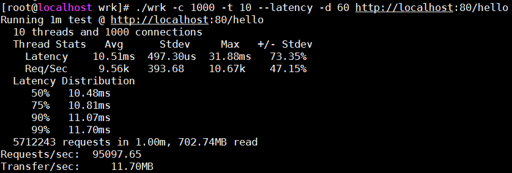
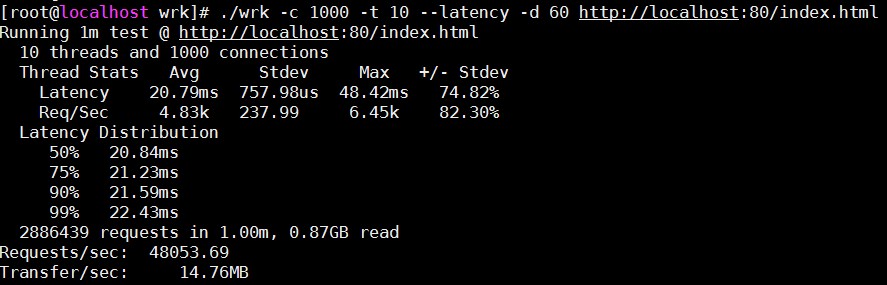
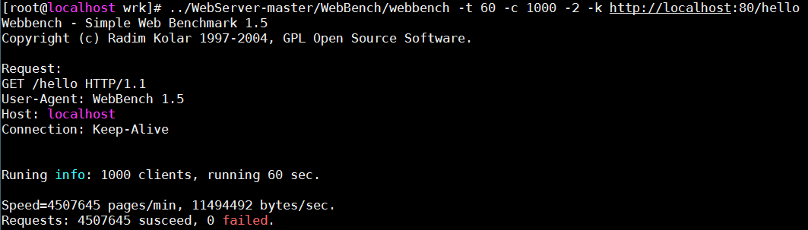
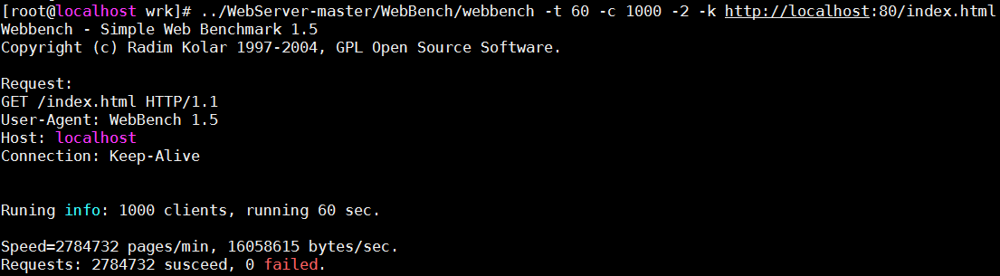
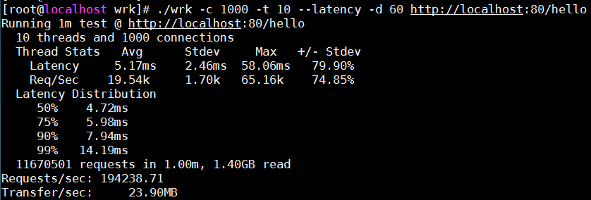
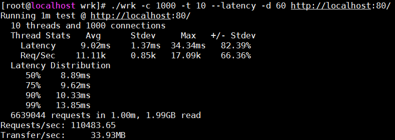

# NetServer
本项目为C++11编写的基于epoll的多线程网络服务器框架，应用层实现了简单的http服务器和一个回声服务器，其中http解析和get方法请求，目前支持静态资源访问，支持http长连接；

#项目目的

学习C++知识、部分C++11的语法和编码规范、学习巩固网络编程、网络IO模型、多线程、git使用、linux命令、TCP/IP已经HTTP协议等知识
在项目过程中参阅了网上许多优秀的博客和开源项目，也参考了陈硕和林亚的代码，在此向他们致敬！

#BUILD

$ make
$ make clean

#RUN

$ ./netserver [port] [IO_ThreadNum] [Worker_ThreadNum]
例： $ ./netserver 80 4 2
表示开启80端口，采用4个IO线程、2个工作线程的方式

#TECH

1. 基于epoll的IO复用机制实现reactor模式，采用边缘触发(ET)模式和非阻塞模式
2. 由于采用ET模式，read、write和accept的时候必须采用循环的方式，直到error==EAGAIN为止，防止漏读等清况，这样的效率会比LT模式高很多，减少了触发次数
3. 线程模型将划分为主线程、IO线程和worker线程，主线程接收客户端连接（accept），并通过Round-Robin策略分发给IO线程，IO线程负责连接管理（即事件监听和读写操作），worker线程负责业务计算任务（即对    数据进行处理，应用层处理复杂的时候可以开启）
4. 基于时间轮实现定时器功能，定时剔除不活跃连接，时间轮的插入、删除复杂度为O(1)，执行复杂度取决于每个桶上的链表长度
5. 采用智能指针管理多线程下的对象资源
6. 支持HTTP长连接
7. 支持优雅关闭连接 
   a. 通常情况下，由客户端主动发起FIN关闭连接
   b. 客户端发送FIN关闭连接后，服务器把数据发完才close，而不是直接暴力close
   c. 如果连接出错，则服务器可以直接close
   
#性能测试

该项目采用了两款开源的http压力测试工具“wrk”和“WebBench”，其中使用了林亚改写后的[WebBench](https://github.com/linyacool/WebBench)
 * 测试方法
   * 模拟1000条TCP连接，持续时间60s
   * 测试长连接情况
   * 考虑到磁盘IO的影响，分别对有/无磁盘IO影响两种情况做测试，测试时服务器的响应报文分别为:
     保存到内存中的HTTP报文（无磁盘IO影响）、HTTP报头+读取磁盘的index.html网页（有磁盘IO影响）
 * 测试环境（虚拟机环境下测试，性能可能较物理机低）
   * CPU: Intel(R) Core(TM) i5-4440 CPU @ 3.10GHz
   * Memory: 2G
   * VirtualBox 5.2.20
   * OS: CentOS Linux release 7.0.1406
   * kernel: 3.10.0-123.el7.x86_64

### 单线程测试 （执行命令：./netserver 80 0 0）
* wrk测试结果：9万+QPS、4万+QPS
  * 内存中的HTTP报文（无磁盘IO影响）
 

  * index.html网页（有磁盘IO影响）
 

* WebBench测试结果
  * 内存中的HTTP报文（无磁盘IO影响）
 

  * index.html网页（有磁盘IO影响）
 
 
 ### 多线程测试1 （4个IO线程 执行命令：./netserver 80 4 0）
* wrk测试结果：21万+QPS、5万+QPS
  * 内存中的HTTP报文（无磁盘IO影响）
 

  * index.html网页（有磁盘IO影响）
 
 
 ### 多线程测试2 （4个IO线程 2个工作线程 执行命令：./netserver 80 4 2）
* wrk测试结果：19万+QPS、11万+QPS
  * 内存中的HTTP报文（无磁盘IO影响）
 

  * index.html网页（有磁盘IO影响）
 
